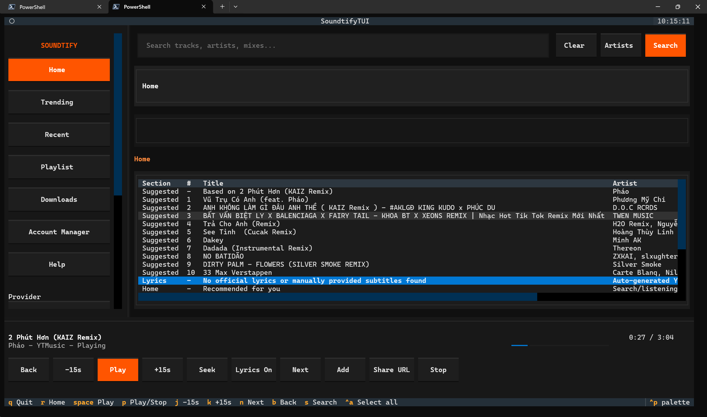
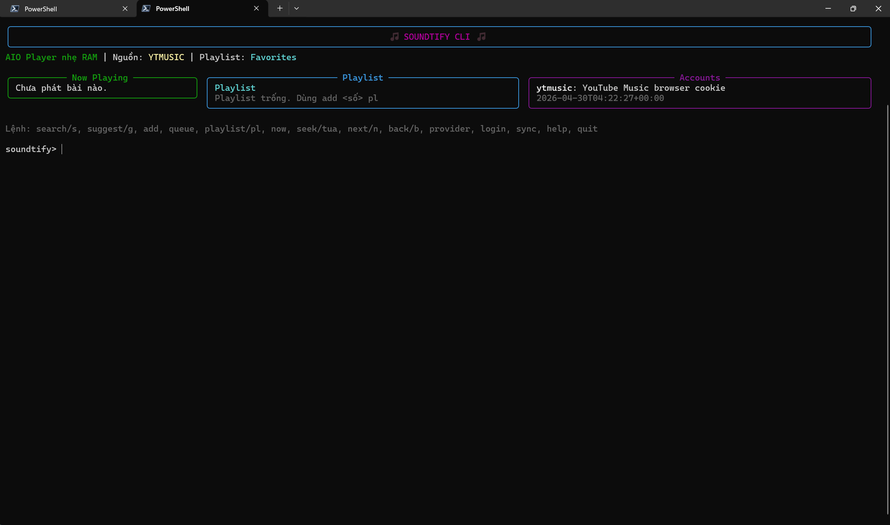

<!-- CLI_CAPTURE_START -->
## Preview

### TUI Home



### Classic CLI


<!-- CLI_CAPTURE_END -->

# 🎵 Soundtify CLI

Soundtify CLI là một ứng dụng nghe nhạc qua dòng lệnh (Command Line Interface) siêu nhẹ, được thiết kế để tiết kiệm tối đa dung lượng RAM. Nó hỗ trợ stream âm thanh trực tiếp từ nhiều nền tảng phổ biến.

## ✨ Tính năng nổi bật

*   **Siêu Nhẹ (AIO Player):** Tích hợp công nghệ tự động tải `ffplay` chạy ngầm. Không cần mở các giao diện nặng nề, chỉ cần gõ lệnh và nghe nhạc với mức RAM tiêu thụ chỉ dưới 50MB.
*   **Hỗ Trợ Đa Nền Tảng:**
    *   **YouTube Music:** Tìm kiếm và phát trực tiếp nhạc chất lượng cao.
    *   **SoundCloud:** Tìm kiếm mọi bài hát, bản mix từ cộng đồng SoundCloud.
    *   **Spotify:** Hỗ trợ tìm kiếm theo cấu trúc của Spotify (tự động mapping qua hệ thống YouTube để nghe nhạc miễn phí không cần Premium).
*   **An Toàn & Bảo Mật:** Bộ nhớ đệm (cache), file cấu hình được bảo mật và xác minh tính toàn vẹn bằng thuật toán băm `SHA-256`.

## 🚀 Hướng dẫn cài đặt & Chạy ứng dụng

Bạn có thể chạy dự án theo 2 cách:

### Cách 1: Sử dụng file chạy trực tiếp (Pre-compiled)
Ứng dụng đã được đóng gói thành file `.exe` độc lập. Bạn không cần cài đặt Python hay bất kỳ phần mềm lập trình nào.
1. Tải file `soundtify.exe` ở phần Release.
2. Mở Terminal (PowerShell/CMD) và chạy file, hoặc đơn giản là nhấp đúp (Double-click) vào file.

### Cách 2: Chạy từ mã nguồn (Dành cho Developer)
1. Yêu cầu hệ thống đã cài đặt Python 3.10+.
2. Clone repository và cài đặt thư viện cần thiết:
   ```bash
   pip install -r requirements.txt
   ```
3. Chạy ứng dụng:
   ```bash
   python main.py
   ```
   Mặc định ứng dụng mở giao diện TUI có hỗ trợ chuột. Nếu muốn dùng giao diện lệnh cổ điển:
   ```bash
   python main.py --classic
   ```

## 📦 Tự động build & release

Repository đã có GitHub Actions tại `.github/workflows/release.yml` để tự động kiểm tra mã nguồn, compile bằng PyInstaller và đóng gói file `soundtify.exe`.

*   Khi push lên `main`/`master` hoặc mở Pull Request: workflow sẽ cài dependencies, chạy `compileall`, build `.exe` và upload artifact.
*   Khi push tag dạng `v*` như `v1.0.0`: workflow sẽ tạo GitHub Release và đính kèm file `soundtify-windows-x64.zip`.
*   Có thể chạy thủ công trong tab **Actions** bằng `workflow_dispatch`; nhập version/tag như `v1.0.0` nếu muốn publish release.

Tạo release mới bằng tag:

```bash
git tag v1.0.0
git push origin v1.0.0
```

## 🎮 Cách sử dụng lệnh (Commands)

Khi ứng dụng chạy, mặc định bạn sẽ thấy giao diện Home kiểu SoundCloud tối giản:

*   Cột trái: Home, Trending, Recently played, Playlist, Downloads, Account Manager, Help và chọn provider.
    *   Nếu màn hình nhỏ, cột trái có thể cuộn bằng chuột để xem đủ nút.
    *   Các nút luôn hiển thị chữ mô tả tác dụng thay vì chỉ icon.
*   Ô tìm kiếm phía trên: nhập bài hát, nghệ sĩ hoặc tâm trạng rồi bấm `Search`.
    *   Khi đang gõ, Soundtify hiện gợi ý từ history/playlist/cache và YouTube Music nếu provider hỗ trợ.
    *   `Ctrl+A` chọn toàn bộ chữ trong ô Search để thay nhanh nội dung.
    *   Bấm `Artists` để tìm tác giả/channel trên YouTube Music.
    *   Chọn artist/channel sẽ mở hai lựa chọn: `Newest music` và `Popular / trending`.
*   Bảng Home ở giữa: gom hàng chờ, bài gợi ý kế tiếp theo bài đang phát, lyrics/subtitle chính thức, và feed đề xuất vào cùng một danh sách gọn. Khi bật autoplay, hết bài Soundtify sẽ ưu tiên queue, sau đó phát bài gợi ý, rồi mới tới playlist.
    *   Lyrics lấy từ YouTube Music trước; nếu không có thì chỉ dùng subtitle thủ công/chính thức của YouTube. Soundtify bỏ qua phụ đề tự tạo của YouTube vì sai lời nhiều. Dòng có timestamp có thể bấm Enter để seek tới đúng đoạn.
*   Thanh phát phía dưới: xem bài đang phát, tác giả, giây hiện tại theo thời gian thực, tiến độ và các nút `Back`, `-15s`, `Play`, `+15s`, `Seek`, `Next`, `Add`, `Share URL`, `Stop`.
    *   Nút `Seek` mở một ô nhập riêng để tua tuyệt đối, ví dụ `83`, `1:23` hoặc `01:02:03`.
    *   Nút `Lyrics On/Off` ẩn hoặc hiện lyrics trong Home; mặc định lyrics tự hiện khi có bài đang phát.
*   Nút `Share URL`: copy link bài đang phát hoặc bài đang chọn vào clipboard.
*   `Tab` chuyển giữa các box, phím mũi tên lên/xuống di chuyển trong bảng, `Enter` chọn dòng/hành động.
*   Nút `Connect provider`, `Sync library`, `Logout provider`: thao tác tài khoản bằng chuột.
    *   Với YouTube Music, `Connect provider` nhận Cookie header của `music.youtube.com` trong ô Search và dùng browser auth kiểu Metrolist.
*   Mục `Downloads`: bật/tắt tự tải bài đã phát, bật/tắt tự phát nhạc đề xuất kế tiếp, bật/tắt SponsorBlock cho YouTube Music, chỉnh số ngày dọn file và ngưỡng lượt phát để giữ lại nhạc nghe thường xuyên.
*   Discord RPC và Windows Now Playing tự cập nhật bài đang phát nếu dependency tương ứng đã được cài.

Phím tắt trong giao diện mới:

*   `S`: focus vào ô tìm kiếm.
*   `Space`: phát bài đang chọn.
*   `P`: start/stop bài đang phát. Nếu đã stop bằng `P`, bấm lại `P` để phát tiếp từ vị trí đã dừng.
*   `J`: tua lùi 15 giây.
*   `K`: tua tới 15 giây.
*   `N`: bài tiếp theo.
*   `B`: bài trước.
*   `R`: về Home.
*   `Q`: thoát.

Khi thoát hoặc khi client gặp lỗi Python, ứng dụng sẽ tự dừng tiến trình `ffplay` đang phát nền để tránh nhạc tiếp tục chạy sau khi UI bị đóng.

Giao diện classic (`python main.py --classic`) vẫn dùng dấu nhắc lệnh `soundtify> ` và hỗ trợ các lệnh sau:

*   `search <từ khóa>` hoặc `s <từ khóa>`: Tìm kiếm một bài hát. Ví dụ: `search em cua ngay hom qua`.
    *   Sau khi tìm kiếm, nhập số để phát ngay.
    *   Nhập `a <số>` để thêm kết quả vào hàng chờ (queue).
    *   Nhập `p <số>` để thêm kết quả vào playlist hiện tại.
*   `provider <tên nguồn>`: Đổi nguồn nhạc. Hỗ trợ: `ytmusic`, `soundcloud`, `spotify`.
*   `now`, `status`, `home`: Hiển thị dashboard gồm bài đang phát, tiến độ, queue, playlist và tài khoản.
*   `suggest <từ khóa>` hoặc `g <từ khóa>`: Gợi ý bài hát liên quan. Nếu bỏ trống từ khóa, ứng dụng gợi ý theo bài đang phát.
*   `add <số> queue`: Thêm kết quả tìm kiếm gần nhất vào queue.
*   `add <số> pl <tên playlist>`: Thêm kết quả tìm kiếm gần nhất vào playlist. Nếu bỏ tên playlist, dùng playlist hiện tại.
*   `queue`: Xem hàng chờ phát.
*   `queue clear`: Xóa toàn bộ hàng chờ phát.
*   `queue remove <số>`: Xóa một bài khỏi hàng chờ phát.
*   `playlist` hoặc `pl`: Xem playlist hiện tại.
*   `playlist use <tên playlist>`: Chuyển hoặc tạo playlist đang dùng.
*   `playlist remove <số>`: Xóa một bài khỏi playlist hiện tại.
*   `seek <+giây|-giây|m:ss>` hoặc `tua <+giây|-giây|m:ss>`: Tua bài đang phát. Ví dụ: `seek +30`, `seek -15`, `seek 1:20`.
*   `next` hoặc `n`: Phát bài tiếp theo trong queue; nếu queue trống thì phát bài tiếp theo trong playlist.
*   `back` hoặc `b`: Quay lại bài trước trong lịch sử phát.
*   `stop`: Dừng phát bài hát hiện tại.
*   `login ytmusic`: Tự lấy cookie YouTube Music từ Edge/Chrome/Brave/Firefox nếu có thể.
*   `login ytmusic <Cookie header>`: Lưu cookie YouTube Music có `SAPISID` hoặc `__Secure-3PAPISID` để search/play bằng browser auth.
*   `login soundcloud`: Tự lấy `oauth_token` SoundCloud từ Edge/Chrome/Brave/Firefox nếu có thể.
*   `login soundcloud <oauth_token>`: Lưu token SoundCloud thủ công để `yt-dlp` phát các nội dung cần đăng nhập.
*   `login <soundcloud|spotify> <tên> [token]`: Lưu trạng thái đăng nhập local cho từng nền tảng.
*   `accounts`: Xem các tài khoản đã lưu.
*   `sync`: Đồng bộ snapshot local của queue, history và playlist vào bộ nhớ bảo mật SHA-256.
*   `logout <ytmusic|soundcloud|spotify>`: Xóa trạng thái đăng nhập local.
*   `quit`, `exit`, `q`: Thoát ứng dụng.

> Lưu ý: YouTube Music dùng cookie auth kiểu Metrolist: Soundtify lưu Cookie header local và tự tạo `SAPISIDHASH` khi gọi YouTube Music. SoundCloud dùng OAuth token và truyền token đó cho `yt-dlp` khi search/play.

## Đăng nhập OAuth và đồng bộ

YouTube Music không dùng Google OAuth làm auth chính. Cách dùng giống Metrolist:

1. Đăng nhập `https://music.youtube.com` trong trình duyệt.
2. Trong TUI: chọn `ytmusic`, bấm `Connect provider`; Soundtify sẽ thử lấy cookie từ Edge/Chrome/Brave/Firefox.
3. Trong classic CLI: chạy `login ytmusic`.
4. Nếu tự lấy cookie thất bại, mở DevTools Network, chọn một request tới `music.youtube.com`, copy giá trị request header `Cookie`.
5. Dán Cookie header vào ô Search rồi bấm `Connect provider`, hoặc chạy `login ytmusic Cookie: SAPISID=...; ...`.

Cookie cần có `SAPISID` hoặc `__Secure-3PAPISID`; Soundtify sẽ tự dựng header `Authorization: SAPISIDHASH ...` cho `ytmusicapi` và truyền cookie cho `yt-dlp`.

Nếu trình duyệt chặn auto-import cookie, bạn có thể dùng Chromium extension local:

1. Mở `chrome://extensions` hoặc `edge://extensions`.
2. Bật `Developer mode`.
3. Chọn `Load unpacked`.
4. Chọn thư mục `extensions/chromium-cookie-helper`.
5. Đăng nhập `https://music.youtube.com`, bấm extension, chọn `Copy Cookie Header`.
6. Dán vào ô Search trong Soundtify rồi chọn `Account Manager -> ytmusic -> Paste cookie from Search`.

Spotify/SoundCloud có thể tạo link OAuth thật nếu bạn cấu hình client credentials riêng. Với SoundCloud, access token sau khi login sẽ được dùng trực tiếp cho `yt-dlp` bằng chế độ `oauth`. Với Spotify, token dùng để lấy metadata track chính xác từ Spotify Web API, còn playback vẫn map qua YouTube Music vì Spotify không cung cấp URL audio full track thô cho app kiểu này. Tạo file bảo mật local trong thư mục dữ liệu app tên `auth_config.json`, hoặc đặt biến môi trường:

```json
{
  "spotify": {
    "client_id": "SPOTIFY_CLIENT_ID",
    "redirect_uri": "http://127.0.0.1:8765/callback"
  },
  "soundcloud": {
    "client_id": "SOUNDCLOUD_CLIENT_ID",
    "client_secret": "SOUNDCLOUD_CLIENT_SECRET",
    "redirect_uri": "http://127.0.0.1:8765/callback"
  }
}
```

Biến môi trường tương ứng:

*   `SOUNDTIFY_SPOTIFY_CLIENT_ID`
*   `SOUNDTIFY_SOUNDCLOUD_CLIENT_ID`
*   `SOUNDTIFY_SOUNDCLOUD_CLIENT_SECRET`

Cách dùng trong TUI:

1. Chọn provider ở sidebar.
2. Mở tab `Account Manager` để xem tài khoản đã liên kết, trạng thái pending, token và lần sync gần nhất.
3. Trong `Account Manager`, chọn một dòng tài khoản rồi bấm Enter/click để mở menu hành động.
4. Menu hành động có `Login / Connect`, `Sync now`, `Disconnect`, `Back to Account Manager`.
5. Nếu bấm provider ở sidebar khi đang ở `Account Manager`, app cũng mở menu hành động cho provider đó.
6. Nếu bấm `Login / Connect` nhưng chưa có cookie/cấu hình, Soundtify sẽ tự hiện hướng dẫn login tương ứng.
7. Với Spotify/SoundCloud, hướng dẫn login tự mở `http://127.0.0.1:8766/?provider=<provider>` trong trình duyệt.
8. Trang setup local có input `client_id`, `client_secret`, `redirect_uri`; bấm Save sẽ ghi vào `auth_config.json` trong app data, không cần nhập biến môi trường thủ công.
9. Với YouTube Music, chọn `Auto import browser cookie` để tự lấy cookie, hoặc `Paste cookie from Search` nếu muốn dán thủ công.
10. Với SoundCloud, chọn `Auto import browser token`, `Paste token from Search`, hoặc `Official OAuth login`.
11. Nếu redirect URI là `http://127.0.0.1:8765/callback` và đã được đăng ký trong app dashboard, Soundtify sẽ tự nhận callback và lưu token.
12. Nếu provider không redirect được về loopback, copy callback URL hoặc riêng giá trị `code`, paste vào ô Search rồi chọn OAuth login lần nữa.
13. `Sync now` lưu snapshot queue/history/playlist vào tài khoản đã kết nối.

## Downloads tự động

Mục `Downloads` trong sidebar cho phép:

*   Bật/tắt tự tải các bài đã phát thành công.
*   Tự phát file local nếu bài đó đã được tải trước đó.
*   Bật/tắt tự phát nhạc đề xuất kế tiếp sau khi bài hiện tại kết thúc bình thường.
*   Bật/tắt SponsorBlock để tự bỏ qua đoạn sponsor trên các track YouTube Music khi SponsorBlock có dữ liệu.
*   Dọn file tải về theo quy tắc: file cũ hơn số ngày đã chọn và có số lượt phát thấp hơn ngưỡng giữ lại sẽ bị xóa khi cleanup chạy.
*   Bấm `Cleanup now` để chạy dọn ngay, hoặc để Soundtify tự chạy sau mỗi lần phát bài.

Spotify dùng Authorization Code with PKCE. YouTube Music dùng browser cookie + `SAPISIDHASH` giống Metrolist. SoundCloud dùng OAuth 2.1/PKCE và hiện vẫn cần `client_secret` để đổi token.

## Discord RPC và Windows Now Playing

Soundtify có thể hiện bài đang phát trong Discord Rich Presence và Windows media controls:

*   Cài dependency bằng `pip install -r requirements.txt`.
*   Windows Now Playing tự bật qua `winrt-Windows.Media` khi chạy trên Windows.
*   Discord RPC mặc định dùng Soundtify Discord Application ID `1499277199012925482`.
*   Nếu muốn dùng app Discord riêng, đặt biến môi trường `SOUNDTIFY_DISCORD_CLIENT_ID`, hoặc tạo file `presence_config.json` trong app data:

```json
{
  "discord_client_id": "YOUR_DISCORD_APP_CLIENT_ID"
}
```

Nếu thiếu Discord, thiếu client id hoặc thiếu Windows API package, Soundtify chỉ ghi log debug và vẫn phát nhạc bình thường.

## 📁 Cấu trúc thư mục

*   `src/ui/`: Xử lý giao diện CLI tương tác (Rich, prompt_toolkit).
*   `src/core/`: Logic mã hóa bảo mật cache (`security.py`) và điều khiển stream nhạc ngầm (`player.py`).
*   `src/providers/`: Chứa các module tương tác API nguồn nhạc (YT Music, SoundCloud, Spotify).
*   `main.py`: Tệp khởi chạy chính.
*   `requirements.txt`: Danh sách các thư viện phụ thuộc.

---
*Dự án được xây dựng bằng phong cách "Vibe Coding" với giao diện CLI tối giản và hiệu quả.*
